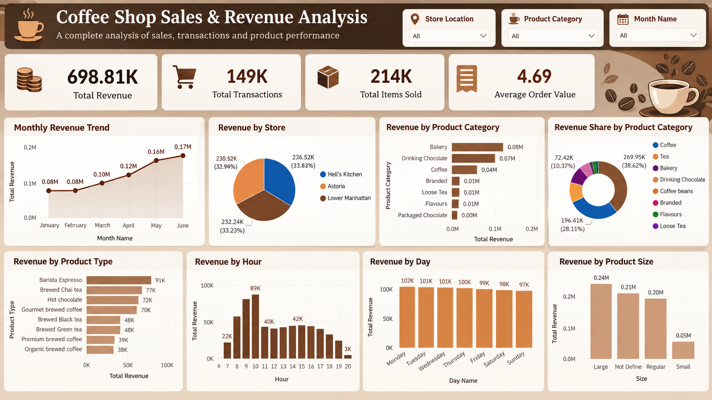

# Retail Sales, Revenue & Performance Analytics Dashboard

## Project Overview

An end-to-end retail sales analytics project using Excel, SQL, and Power BI to clean, analyze, and visualize sales transaction data and generate business insights.

## Tools & Technologies

- Excel
- SQL
- Power BI
- Power Query
- DAX

## Project Workflow

1. Cleaned and prepared the retail sales transaction data using Excel and Power Query.
2. Performed SQL-based analysis to calculate revenue, transactions, sales by category, store performance, product performance, and sales trends.
3. Created Power BI measures for key business KPIs.
4. Built an interactive Power BI dashboard to visualize sales and revenue performance.
5. Used slicers and interactive visuals to analyze the data across stores, product categories, and months.

## Key KPIs

- Total Revenue
- Total Transactions
- Total Items Sold
- Average Order Value

## Dashboard Analysis

The Power BI dashboard provides interactive analysis of:

- Monthly Revenue Trends
- Revenue by Store
- Revenue by Product Category
- Top 10 Products by Revenue
- Revenue by Day
- Sales by Hour
- Revenue by Product Size
- Product Category Performance

## Dashboard Preview

## Project Files

- **Excel** – Source and data preparation workbook
- **SQL** – SQL analysis queries
- **Power BI** – Interactive Power BI dashboard
- **Dashboard** – Dashboard preview image

## Skills Demonstrated

- Data Cleaning
- Data Transformation
- SQL Analysis
- KPI Development
- Data Visualization
- Dashboard Development
- Business Insight Generation
